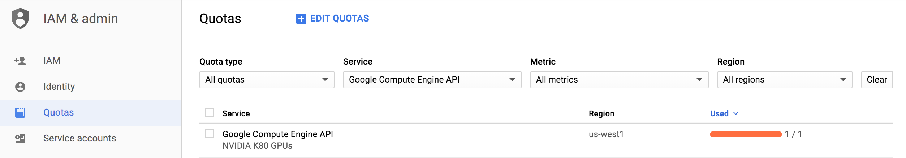
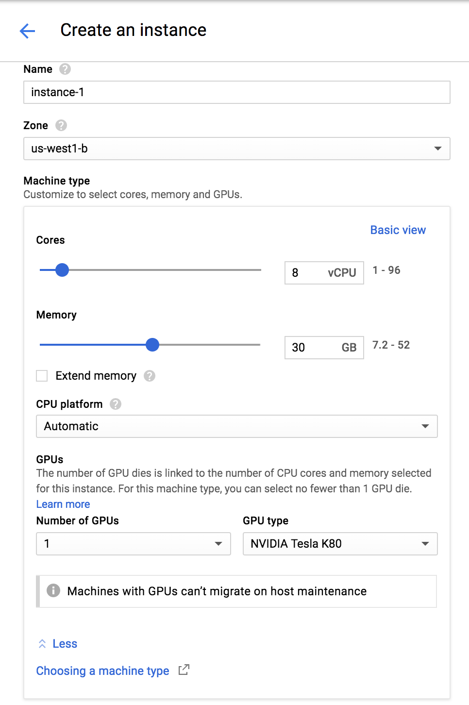
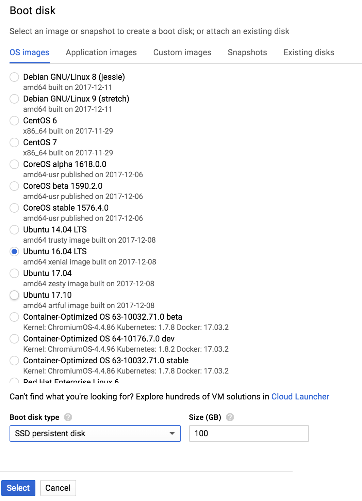
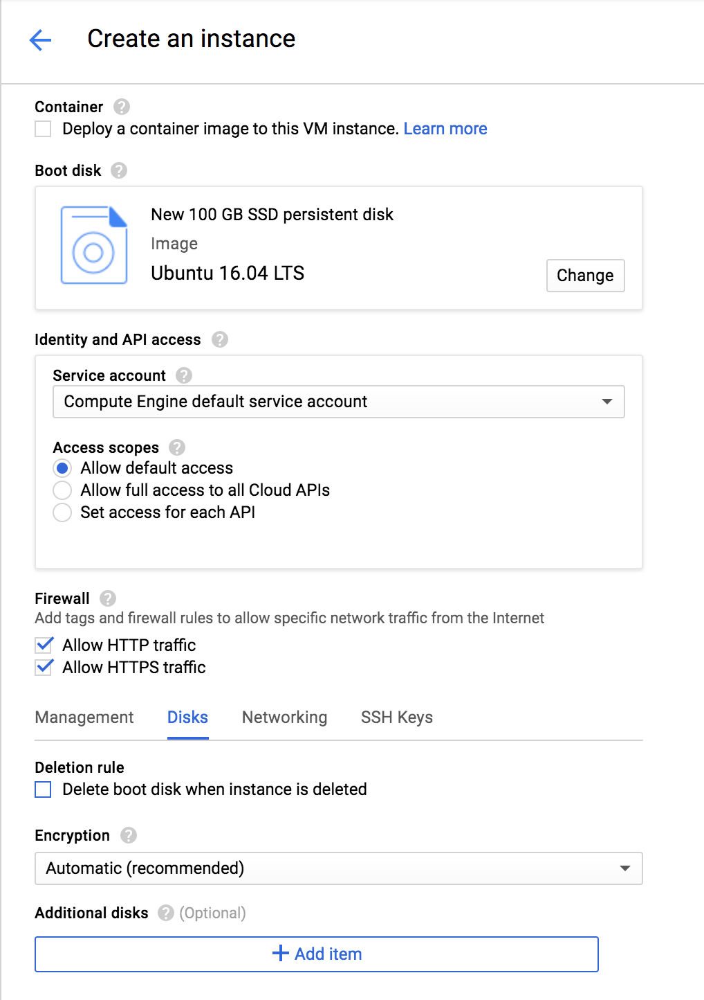
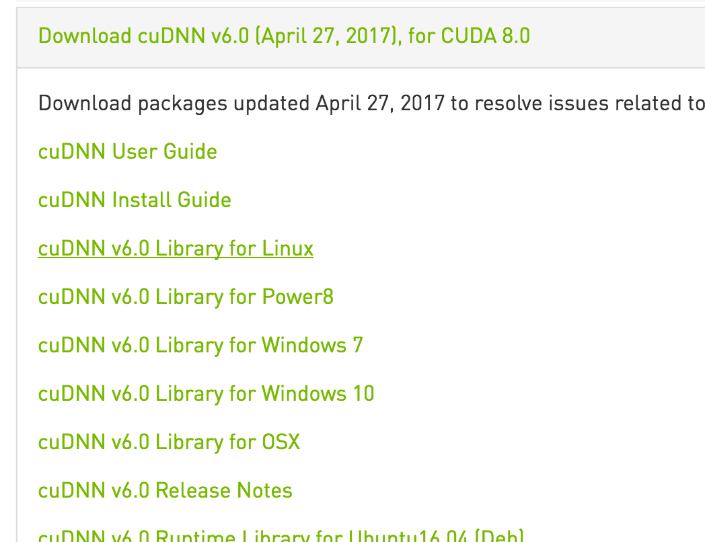

# Install tensorflow 1.4 using GPU on Google Cloud Platform
Now the good news is google give a free $300 credit for new users,
include GPU quota. Let's go throught the manual process step by step. I'm assuming you have
basic knowledge about some basic things, like installing python, operating google cloud console.
## GPU quota request on GCP:
By default, new users' GPU quota is zero. First step
is to request the GPU quota on GCP.


## Create VM instance:
choose CPU,Ram and GPU, please note region should be sync with your quora request before.

config the boot disk size.
Please note the default 10G is not enough for GPU driver.

Remove the option on Deletion rule, in case to re-create a VM.

## Install GPU driver on VM:
Note that tensorflow 1.4 support Cuda 8 version.
```shell
sudo apt-get install cuda-8-0 
```
configure enviroment:
```shell
echo 'export CUDA_HOME=/usr/local/cuda' >> ~/.bashrc  
echo 'export PATH=$PATH:$CUDA_HOME/bin' >> ~/.bashrc  
echo 'export LD_LIBRARY_PATH=$LD_LIBRARY_PATH:$CUDA_HOME/lib64' >> ~/.bashrc  
source ~/.bashrc
```
## Install cuDNN on VM:
click [here](https://developer.nvidia.com/rdp/cudnn-download)
to download cuDNN file, 
need to register on Nividia site.
,tensorflow 1.4 is now only support
cuDNN V6.
  
Once the file is downloaded, 
transfer the file to VM by google cloud command:
```shell
gcloud compute scp --zone "us-west1-b" ../../cudnn-8.0-linux-x64-v6.0.tgz instance-gpu-1:./
```
Release the file on VM:
```shell
tar xzvf cudnn-8.0-linux-x64-v6.0.tgz
sudo cp cuda/lib64/* /usr/local/cuda/lib64/
sudo cp cuda/include/cudnn.h /usr/local/cuda/include/
```
## Install Tensorflow GPU
```shell
sudo apt-get install python-dev python-pip libcupti-dev
sudo pip3 install --upgrade tensorflow-gpu 
```
Verification python code snippet:
```python
import tensorflow as tf
print(tf.__version__)
# Creates a graph.
with tf.device('/gpu:0'):
  a = tf.constant([1.0, 2.0, 3.0, 4.0, 5.0, 6.0], shape=[2, 3], name='a')
  b = tf.constant([1.0, 2.0, 3.0, 4.0, 5.0, 6.0], shape=[3, 2], name='b')
c = tf.matmul(a, b)
# Creates a session with log_device_placement set to True.
sess = tf.Session(config=tf.ConfigProto(log_device_placement=True))
# Runs the op.
print(sess.run(c))
```
If you want to setup python virtual enviroment
and jupyter notebook, see [cs231 tutorial](http://cs231n.github.io/gce-tutorial/)
for google cloud platform.


